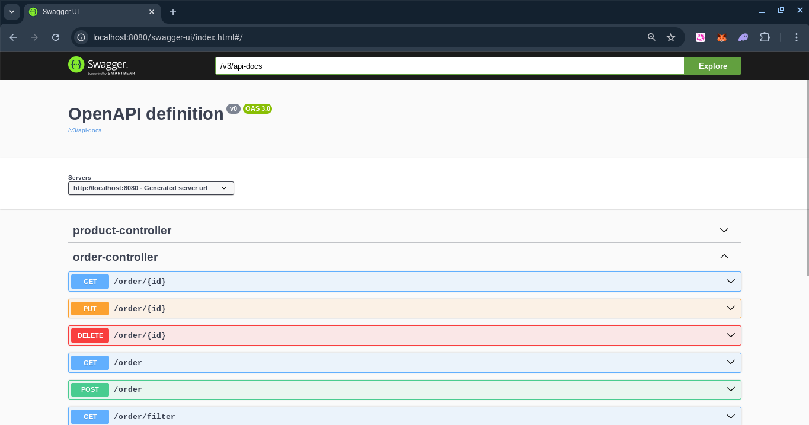
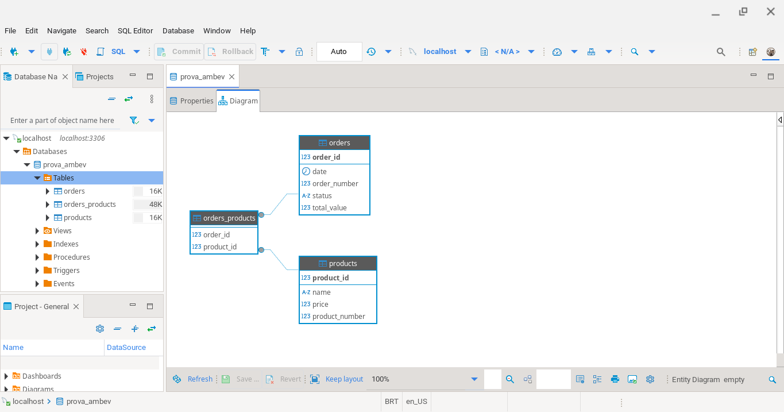

# Cadastro de Ordens

API de Cadastro de Ordens, desenvolvido em Java com Spring-Boot.


## Características

- API RESTful
- Validation
- Service Registry
- Service Discovery
- Message Queue
- MockMVC
- Clean Code

## Requisitos

- Java JDK 21
- Apache Maven >= 3.9.8
- MySql 8
- Consul 1.10.4
- RabbitMQ 3.9.13
- Docker (Opcional)


## Tecnologias

- Java
- JPA
- Hibernate
- Maven
- Spring
- Lombok
- Jakarta
- JSON
- MySql
- JUnit
- Consul
- RabbitMQ
- Docker


## Instalação

```
git clone https://github.com/danilomeneghel/order-registration.git

cd order-registration
```


## MySql

Abra seu MySql e crie as 2 bases de dados:

order_db <br>
product_db


## Consul

Depois rode o Consul.<br>
Caso não tenha o Consul instalado, execute o seguinte comando Docker:

```
docker run -d --name consul -p 8500:8500 consul:1.10.4
```

## RabbitMQ

Primeiro rode o RabbitMQ.<br>
Caso não tenha o RabbitMQ instalado, execute o seguinte comando Docker:

```
docker run -d --name rabbitmq -p 5672:5672 -p 15672:15672 rabbitmq:3.9.13-management
```


## Maven

Para carregar o projeto, digite no terminal:

```
cd order-service
mvn clean spring-boot:run -Dspring-boot.run.profiles=dev
```

Aguarde carregar todo o serviço web. <br>
Após concluído, digite o endereço abaixo em seu navegador: <br>

http://localhost:8080/order <br>


```
cd product-service
mvn clean spring-boot:run -Dspring-boot.run.profiles=dev
```

Aguarde carregar todo o serviço web. <br>
Após concluído, digite o endereço abaixo em seu navegador: <br>

http://localhost:8081/product <br>


## Docker (Opcional)

Para rodar o projeto via Docker, bastar executar o seguinte comando:

```
docker compose up
```

Aguarde baixar as dependências e carregar todo o projeto, esse processo é demorado. <br>
Caso conclua e não rode pela primeira vez, tente novamente executando o mesmo comando. <br>

Para encerrar tudo digite:

```
docker compose down
```


## Swagger

Documentação da API RESTful:

http://localhost:8080/swagger-ui.html


## Screenshots

Swagger-UI <br>
 <br><br>

Modelagem ER <br>
 <br><br>


## Licença

Projeto licenciado sob <a href="LICENSE">The MIT License (MIT)</a>.<br><br>


Desenvolvido por<br>
Danilo Meneghel<br>
danilo.meneghel@gmail.com<br>
http://danilomeneghel.github.io/<br>
